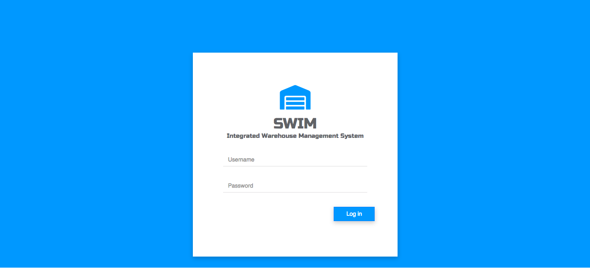
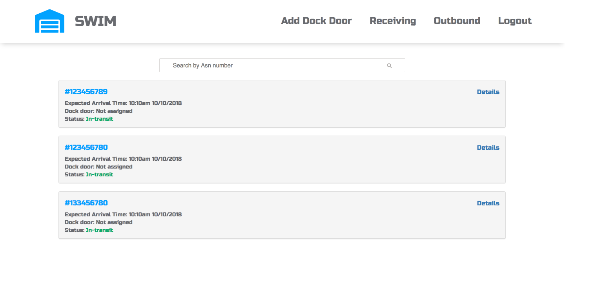
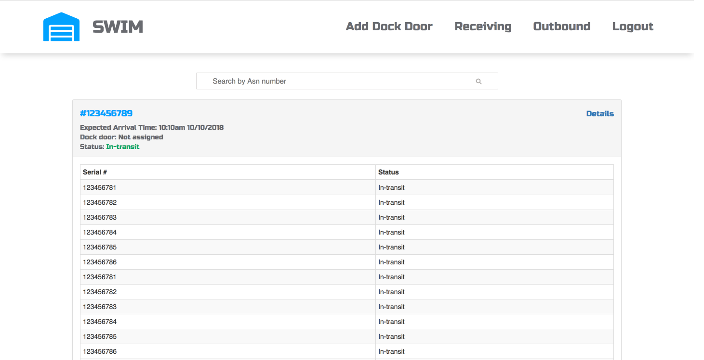
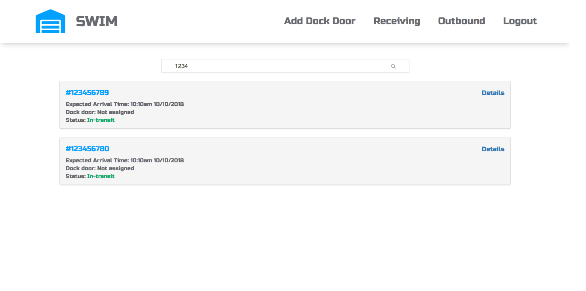
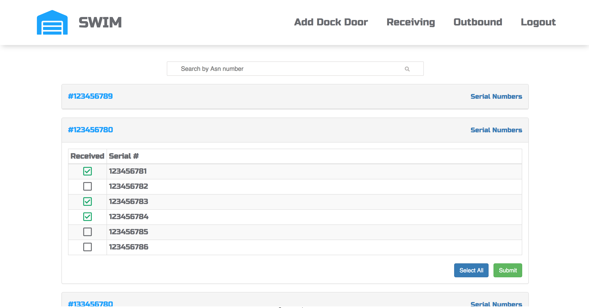
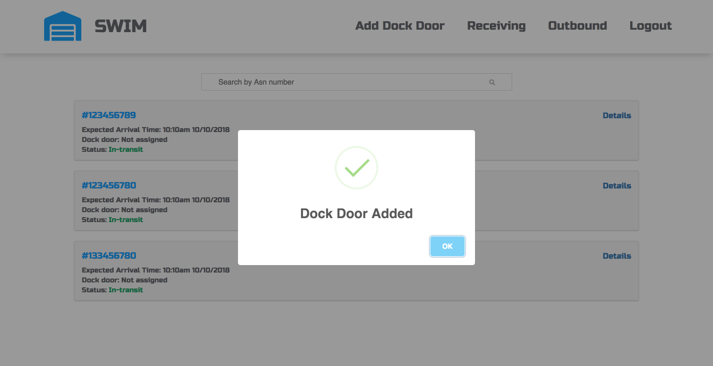

# SWIM 
Swim is a warehouse management software system to manage warehouse operations. This application allows the user to receive Advanced Shipping Notice (ASN) details from vendors, receive products on arrival, and ship products.

### Login:

### Dashboard:

### Receiving:

### Dockdoor configuration:

 
